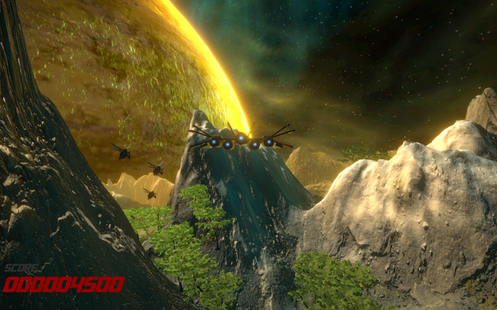

# unity-argon-assault-2023

Small 3D space shooter game built with Unity

This project is done as part of the **Complete C# Unity Game Developer 3D course** instructed by Ben Tristem. Within the scope of this undertaking, I gained proficiency in crafting custom terrains, adeptly navigated through timeline functionality, and successfully delved into fundamental UI manipulation techniques.

## How to play

The goal of the game is to reach the landing pad (yellow) by maneuvering through the obstacles.

The game is hosted [here](https://sharemygame.com/@Aerialguard/argon-assault),
or alternatively, download the `.rar` from this github's releases to try out the game!

## Controls

W, A, S, D - Move ship up, down, left, right
Mouse 1(left click) - shoot
Esc - exit game

## Features

- 1 Level
- 3 types of enemies

## Limitations

- Only 1 level
- Basic elements of a shooter game
- No other features such as power ups or customisation
